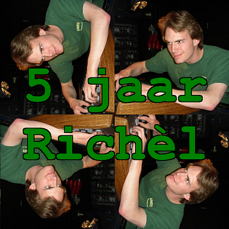
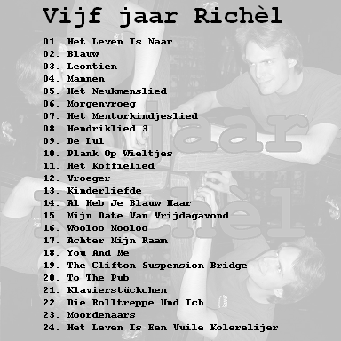

# Vijf Jaar Richel

Richel Bilderbeek's 6th CD called 'Vijf Jaar Richel'.




| # | Title | OGG |
| --- | --- | --- |
| 01. | Het Leven is naar | [here](CD06_01HetLevenIsNaar20070120.ogg) |
| 02. | Blauw | [here](CD06_02Blauw20060902.ogg) |
| 03. | Leontien | [here](CD06_03Leontien.ogg) |
| 04. | Mannen | [here](CD06_04Mannen.ogg) |
| 05. | Het ****menslied | [here](CD06_05HetNeukmenslied.ogg) |
| 06. | Morgenvroeg | [here](CD06_06Morgenvroeg20060812.ogg) |
| 07. | Het Mentorkindjeslied | [here](CD06_07HetMentorkindjeslied.ogg) |
| 08. | Hendriklied 3 | [here](CD06_08Hendriklied3_20060812.ogg) |
| 09. | De *** | [here](CD06_09DeLul20060902.ogg) |
| 10. | Plank op wieltjes (onaf liedje) | [here](CD06_10PlankOpWieltjes20060812.ogg) |
| 11. | Het Koffielied | [here](CD06_11HetKoffielied.ogg) |
| 12. | Vroeger | [here](CD06_12Vroeger.ogg) |
| 13. | Kinderliefde | [here](CD06_13Kinderliefde.ogg) |
| 14. | Al heb je blauw haar | [here](CD06_14AlHebJeBlauwHaar20060902.ogg) |
| 15. | Mijn date van vrijdagavond | [here](CD06_15MijnDateVanVrijdagavond20070717_2.ogg) |
| 16. | Wooloo Mooloo | [here](CD06_16WoolooMooloo20060902.ogg) |
| 17. | Achter mijn raam | [here](CD06_17AchterMijnRaam20060717_2.ogg) |
| 18. | You and me | [here](CD06_18YouAndMe.ogg) |
| 19. | The Clifton Suspension Bridge | [here](CD06_19TheCliftonSuspensionBridge.ogg) |
| 20. | To The Pub | [here](CD06_20ToThePub.ogg) |
| 21. | Klavierstueckchen | [here](CD06_21Klavierstueckchen.ogg) |
| 22. | Die Rolltreppe Und Ich | [here](CD06_22DieRolltreppeUndIch.ogg) |
| 23. | Moordenaars | [here](CD06_23Moordenaars.ogg) |
| 24. | Het Leven is een ***** *********** | [here](CD06_24HetLevenIsEenVuileKolerelijer.ogg) |

## Build

[](https://travis-ci.org/richelbilderbeek/VijfJaarRichel)

To build the MP3's and zip file, use:

```
./ogg_to_mp3.zip
./zip_oggs.sh
./zip_mp3.sh
```


